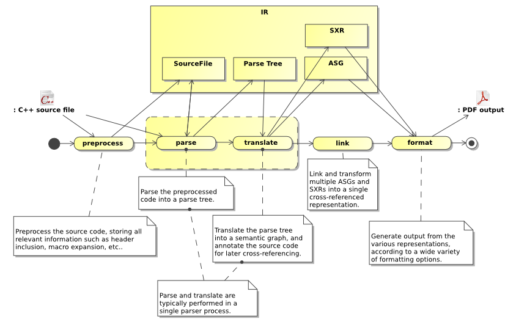

Introduction
============

Synopsis is a source code introspection tool. It provides parsers for a variety of programming languages (C, C++, Python, IDL), and generates internal representations of varying granularity. The only stable representation, which is currently used among others to generate documentation, is an Abstract Semantic Graph.

This tutorial is focussed on the ASG and the concepts around it. Other representations are presently being worked on, notably in relation to the C++ parser. To learn more about those (Parse Tree, Symbol Table, etc.) see the Developer's Guide. 

Inspecting code
---------------

Internal representation
-----------------------

Synopsis parses source code into a variety of internal representations (IRs), which then are manipulated in various ways, before some output (such as a cross-referenced API documentation) is generated by an appropriate formatter.

At the core of Synopsis are a set of programming-language independent IRs which all parser frontends generate. One of these representations is the Abstract Semantic Graph, which stores declarations and their relationships. Another is the SXR Symbol Table, which stores information about symbols and their use in the source code. Other representations exist (such as the C++ Parse Tree), but they are not yet stored in a publicly accessible form.

.. image:: images/ir.png

For details about the ASG, see the section called “The ASG”

At this time, the C++ frontend's IRs (PTree, SymbolTable, etc.) are not yet accessible through python, though they eventually will be, making it possible to use Synopsis as a source-to-source compiler. To learn more about the evolving C & C++ parser and its IRs, see the Developer's Guide.

Documenting Source-Code
-----------------------

Being read and understood is at least as important for source code as it is for it to be processed by a computer. Humans have to maintain the code, i.e. fix bugs, add features, etc.

Therefor, typically, code is annotated in some form in that adds explanation if it isn't self-explanatory. While comments are often used to simply disable the execution of a particular chunk of code, some comments are specifically addressed at readers to explain what the surrounding code does. While some languages (e.g. Python) have built-in support for `doc-strings`, in other languages ordinary comments are used.

Typically, comments are marked up in a specific way to discriminate documentation from ordinary comments. Further the content of such comments may contain markup for a particular formatting (say, embedded HTML).

C++ may contain a mix of comments, some representing documentation:

.. code-block:: c++

  //! A friendly function.
  void greet()
  { 
    // FIXME: Use gettext for i18n
    std::cout << "hello world !" << std::endl;
  }
        

In Synopsis all declarations may be annotated. C and C++ parsers, for example, will store comments preceding a given declaration in that declaration's annotations dictionary under the key comments. Later these comments may be translated into documentation (stored under the key doc), which may be formatted once the final document is generated.

Translating comments into doc-strings involves the removal of comment markers (such as the //! above), as well as the handling of processing instructions that may be embedded in comments, too.

For languages such as Python such a translation isn't necessary, as the language has built-in support for documentation, and thus the parser itself can generate the 'doc' annotations.

Python has support for documentation built into the language:

.. code-block:: python

  >>> def greet():
  ...     """The greet function prints out a famous message."""
  ...     print 'hello world !'
  ...
  >>> help(greet)

  Help on function greet in module __main__:
  
  greet()
      The greet function prints out a famous message.
        

The Synopsis Processing Pipeline
--------------------------------

Synopsis provides a large number of processor types that all generate or operate on data extracted from source code. Parsers parse source code from a variety of languages, linkers combine multiple IRs, resolving cross-references between symbols, and formatters format the ASG into a variety of output media.

A typical processing-pipeline to generate API Documentation with source-code cross-references.

All these Processor types share a common design, to make it easy to combine them into pipelines, and add custom processors. For more documentation about this architecture, see the section called “Composing A Pipeline”.

